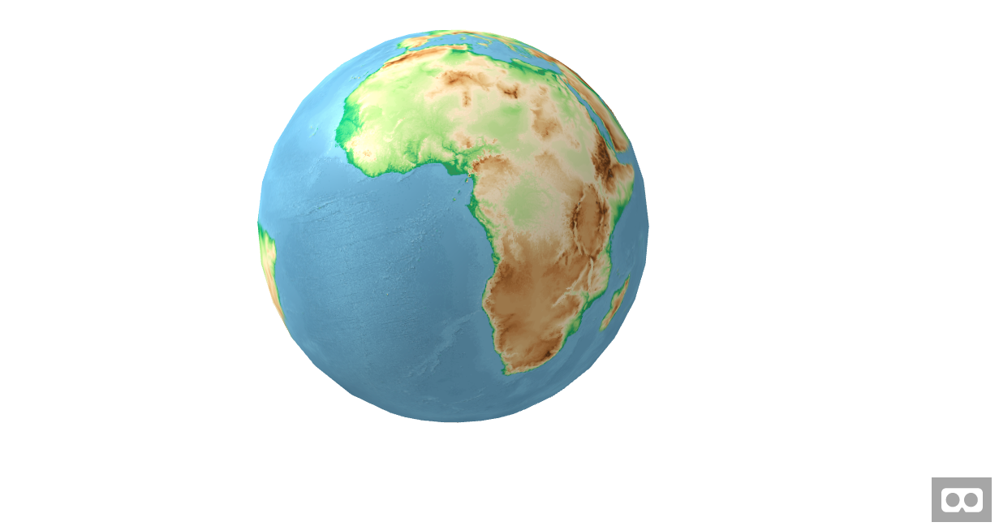

# aframe-wms-component

An A-Frame component to deal with WMS (Web Map Service).

This library implements a WMS GetMap request, the result is a single image which is added into the component material _"SRC:"_ parameter. 

Make sure you request a valid WMS with the correct parameters.

Example with a globe:


### Schema

| Property | Description | Default Value | Required |
| -------- | ----------- | ------------- | ---- |
| **url** | The main URL of the WMS. | | true|
| **bbox** | The bonding box of the requested area.  | | true |
| **projection** | The projection. This projection must be available in the WMS.  | | true |
| **layers** | The WMS layers which will be requested.  | | true |
| **width** | Image request width. It is recommended to change this value according to your needs.   | 250 px | false |
| **height** | Image request height. It is recommended to change this value according to your needs.   | 250 px | false |
| **version** | The WMS version.  | 1.3.0 | false |
| **format** | The image format.  | png | false |
| **transparent** | If true the resulting image will allow transparency.   | true | false |
| **styles** | Used for specify the WMS/layer styles.   | none | false |

### Installation


#### npm

Via npm:

```bash
npm install aframe-wms-component
```

Then

```js
require('aframe');
require('aframe-wms-component');
```

#### Directly including the [minified file](dist)

```html
<html>
  <head>
    <title>A-Frame WMS Component - Simple example</title>
    <meta name="description" content="Simple example for WMS component in a flat panel."></meta>
        <script src="https://aframe.io/releases/0.7.1/aframe.min.js"></script> 
    <script src="https://unpkg.com/aframe-wms-component/dist/aframe-wms-component.min.js"></script> 
  </head>
  <body>
    <a-scene>
      <a-assets>
      </a-assets>
      <a-entity position="1 1.8 -2">
        <a-entity 
        material="color: #000;opacity:1;"
        geometry="primitive: plane; width:4;height:2;"
          wms="
          url: http://ows.terrestris.de/osm/service;
          bbox: -88,-180,88,180;
          projection: EPSG:4326;
          version: 1.3.0;
          format: PNG;
          layers: OSM-WMS;
          width: 4048;
          height: 2024;
          "
         /></a-entity>
        </a-entity>
    </a-scene>
  </body>
</html>
```

### Examples

[Simple plane](https://lcalisto.github.io/aframe-wms-component/examples/simple/)

[Rotating globe and a plane](https://lcalisto.github.io/aframe-wms-component/examples/rotating/)

[Inverted globe](https://lcalisto.github.io/aframe-wms-component/examples/inverted/)


### Further development
A WMS Get Feature Info request based on the raycaster may be implemented in future releases. 
